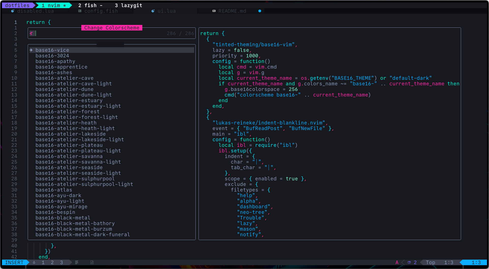

# dotfiles

Here's some configuration and stuff I use… for now.

## Updates

### May 2024

#### Custom Neovim Config based on kickstart.nvim

My Neovim config is fully custom (i.e. no longer running the LazyVim distro) and based on [kickstart.nvim](https://github.com/nvim-lua/kickstart.nvim).
I've moved it over to its own repository at [iainsimmons/nvim-config](https://github.com/iainsimmons/nvim-config).

#### yazi

I'm also using [yazi](https://github.com/sxyazi/yazi) as my file explorer (also in Neovim via [mikavilpas/yazi.nvim](https://github.com/mikavilpas/yazi.nvim)).

#### tide prompt

I'm also giving the [tide](https://github.com/IlanCosman/tide) prompt a shot (previously used [Starship](https://starship.rs/), which could probably be configured the same). It has a nice CLI configuration flow, but otherwise loosely based on [powerlevel10k](https://github.com/romkatv/powerlevel10k/).

It's been a little strange at times, so I might switch back to something simpler with Starship.

### April 2024

Started using [stow](https://www.gnu.org/software/stow/manual/stow.html) following [this guide](https://systemcrafters.net/managing-your-dotfiles/using-gnu-stow/) and based on recommendations from people in [Josh Medeski's Discord](https://www.joshmedeski.com/).

### March 2024

#### base16

Switched to using base16 for theming

- <https://github.com/tinted-theming/home>
- <https://github.com/tinted-theming/tinted-shell>
- <https://github.com/tinted-theming/tinted-vim>
- <https://github.com/tinted-theming/tinted-tmux>
- <https://github.com/tinted-theming/tinted-fzf>

See [gallery](https://tinted-theming.github.io/base16-gallery/).

Current/favourite theme is `base16-vice`:

Otherwise `base16-tokyo-night-dark` or `base16-tokyo-night-storm` for presenting to colleagues.

#### sesh

Switched to using Josh Medeski's [sesh](https://github.com/joshmedeski/sesh) for managing tmux sessions instead of my fork of his old [t - smart tmux session manager](https://github.com/joshmedeski/t-smart-tmux-session-manager).

This means I'm using a tmux session and multiple windows per git repo instead of a new window in the one session and multiple panes per repo.

### January 2024

Updated `run` script to use fzf to select a script to run. Based on [David Sancho's script](https://sancho.dev/blog/better-yarn-npm-run) and [Josh Medeski's d script](https://github.com/joshmedeski/dotfiles/blob/21ffda912711311c79c1175ede7df01b68a13260/.config/bin/d)

### December 2023

Switched to wallpaper backgrounds in WezTerm and transparency in Neovim. Mostly using synthwave/cyberpunk/neon style backgrounds.

Also ported some of the colours from the [fluoromachine.nvim theme](https://github.com/maxmx03/fluoromachine.nvim) to WezTerm and tmux to get things more consistent.

### September 2023

Switched from Alacritty to [WezTerm](https://wezfurlong.org/wezterm/). Really loving the Lua configuration, though I definitely still prefer tmux for multiplexing.

### April 2023

Got sick of trying to manually copy over dotfiles, so now I'm following this method: [Managing my dotfiles as a git repository
](https://drewdevault.com/2019/12/30/dotfiles.html). We'll see how it goes!

Also trying out [direnv](https://direnv.net/) as recommended by a colleague. Very handy!

### January 2023

Switched from VS Code to [Alacritty](https://alacritty.org/), [Neovim](https://neovim.io), and [tmux](https://tmux.github.io/) over the holiday break, and I'm loving it so far!
