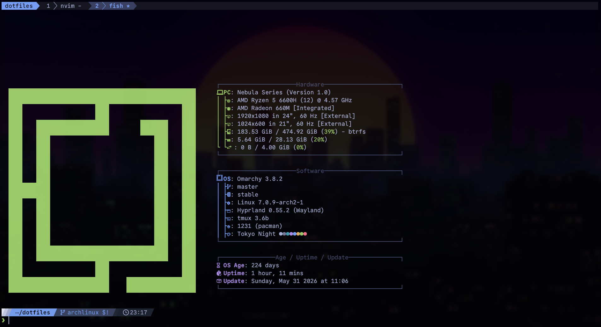
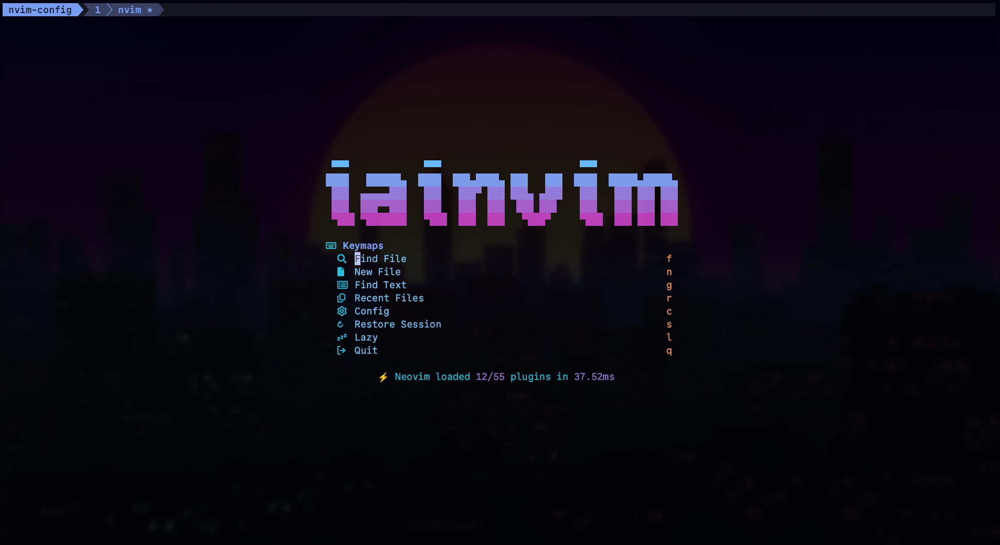

# dotfiles




Here's some configuration and stuff I use… for now.

Also see my [/uses slash page on my website](https://til.iainsimmons.com/uses/).

## Neovim

Looking for my Neovim config? You can find that over at [iainsimmons/nvim-config](https://github.com/iainsimmons/nvim-config).

## Setup

This core of this setup is [mise bootstrap](https://mise.jdx.dev/bootstrap.html).

The `.config/mise/config*.toml` files in this repo are the mise config files that get symlinked to `~/.config/mise/`. There's a shared `config.toml`, and then an OS-specific file that is loaded automatically via [`auto_env`](https://mise.jdx.dev/configuration/environments.html#platform-environments) (`config.linux.toml` for Omarchy/Arch Linux, `config.macos.toml` for macOS), and an additional config selected with a `MISE_ENV` env var for either of the two machines running Omarchy, my mini PC or old MacBook Air. See [config environments](https://mise.jdx.dev/configuration/environments.html).

Environment variables like `MISE_ENV` and the [bootstrap secrets](https://mise.jdx.dev/bootstrap/secrets.html) live in a git ignored `.env` (see `.env.example`, copy and rename to `.env` to use as a base). [`dotfiles-update`](#updating) sources it before running any mise command.

### Config differences

| Machine | OS | Extra config loaded | Differences |
| ----------- | -------------------- | ------------------------------------------ | ------------------------------------------------------------------------------------------------------ |
| Mini PC | Omarchy (Arch Linux) | `config.desktop.toml` (`MISE_ENV=desktop`) | Steam, no keyboard remapper (using mechanical keyboard) |
| Old MacBook Air | Omarchy (Arch Linux) | `config.macbook.toml` (`MISE_ENV=macbook`) | [evremap](https://github.com/wez/evremap) key remapper for laptop keyboard; faster touchpad tracking (`~/.config/hypr/input.macbook.lua`); no Steam |
| Work MacBook Pro | macOS | `config.macos.toml` | Homebrew, zsh, karabiner, skhd, espanso, macOS prefs, no Steam |

### Installation

1. Install mise (see [getting started](https://mise.jdx.dev/getting-started.html)) — the config requires `min_version = 2026.9.1`:

   ```sh
   curl https://mise.run | sh
   ```

2. Clone this repo and link the mise config so mise can read it:

   ```sh
   git clone git@github.com:iainsimmons/dotfiles.git ~/dotfiles
   mkdir -p ~/.config
   ln -s ~/dotfiles/.config/mise ~/.config/mise
   ```

3. Activate mise in your shell (see the [mise getting started docs](https://mise.jdx.dev/getting-started.html)). My fish config already runs `mise activate fish`, follow the mise docs for other shells like bash or zsh.

4. Create the local `.env` from the example and set `MISE_ENV` (plus the bootstrap secrets) for the specific machine:

   ```sh
   cp ~/dotfiles/.env.example ~/dotfiles/.env
   ```

   Then edit `~/dotfiles/.env`. On a Linux machine, pick the additional environment. On macOS, `MISE_ENV` is not needed (`auto_env` loads `config.macos.toml`):

   ```sh
   MISE_ENV=desktop   # desktop mini PC running Omarchy
   # MISE_ENV=macbook # old MacBook Air running Omarchy
   ```

5. Optionally export `MISE_ENV` in your shell so other individual `mise` commands (e.g. `mise bootstrap`) will pick up the machine-specific config:

   ```sh
   export MISE_ENV=desktop   # or macbook
   ```

### Bootstrapping

`mise bootstrap` works the magic (see the [mise bootstrap docs](https://mise.jdx.dev/bootstrap.html)). It installs packages via `[bootstrap.packages]` (using pacman/AUR on Arch Linux and Homebrew on macOS), applies the `[dotfiles]` entries (symlinking, copying or templating config files), sets up the `evremap` service on the MacBook Air running Omarchy/Arch Linux, installs the shared `[tools]` (mostly dev tools), and runs the `bootstrap` task (CLI commands for installing fonts, `bat` theme, `nvpm`, etc.):

```sh
mise bootstrap
```

Or apply just the `dotfiles`, e.g. after pulling updates. Here with `--prompt-secrets`. Also see [Updating](#updating) below.

```sh
mise bootstrap dotfiles apply --prompt-secrets
```

See [mise dotfiles commands](https://mise.jdx.dev/dotfiles.html#commands) for checking status (`mise bootstrap dotfiles status`) and previewing changes (`mise bootstrap dotfiles diff`) before applying.

### Updating

Everything in this mise setup, including the repo itself, mise, the shared `[tools]`, the relevant `[bootstrap.packages]`, and the `bootstrap` task, is updated with one command:

```sh
dotfiles-update
```

It does the following:

1. sources the env vars via the `.env` file
2. pulls the latest commit from this repo: `git pull --ff-only`
3. applies the dotfiles (for the relevant OS/machine): `mise bootstrap dotfiles apply --prompt-secrets`
4. updates mise itself: `mise self-update`
5. upgrade tools (like Node.js): `mise outdated`/`mise upgrade`
6. upgrades configured packages via the relevant package manager: `mise bootstrap packages upgrade`
7. runs the bootstrap task to ensure things are configured correctly: `mise run bootstrap`

> [!note]
>
> - `mise upgrade` for upgrading tools like Node.js, respects the configured version range, so pinned tools (`node = "25.0.0"`, `python = "3.14.4"`) stay put; `mise upgrade --bump` updates the pinned version.
> - Tools using the `github:` source (e.g. `"github:joshmedeski/sesh"`) install the latest GitHub tagged release when set to `"latest"`. Pin a specific release with `mise use github:joshmedeski/sesh@2.29.0`.
> - `dotfiles-update` is intended to run in an interactive shell and may skip steps if automated
> - Removing a tool from `[tools]` does not uninstall it when this is run. Clean up tools with `mise uninstall <tool>`. `mise bootstrap packages prune` prunes packages no longer declared in `[bootstrap.packages]`.

## Changelog

### September 2026

Replaced [GNU Stow](https://www.gnu.org/software/stow/) with [mise bootstrap](https://mise.jdx.dev/) for managing dotfiles across all OSes and machines that I use. Configs are now in `~/.config/mise/`, including a shared `config.toml`, `config.linux.toml` for Omarchy/Arch Linux and `config.macos.toml` for macOS. The old `custom-omarchy-install.sh` became the `[bootstrap.packages]` section plus the `bootstrap` task (`mise task run bootstrap`). See [Setup](#setup).

I also removed the configs and packages for stuff I'm not using anymore: Vicinae, Ghostty, WezTerm, lf, waybar, oyo, Posting, Slumber, Discord, Vivaldi and gitmux. I'm only using [kitty](https://sw.kovidgoyal.net/kitty/) as my terminal everywhere now.

### May 2026

Ghostty is great, but I did not particularly like how it was configured, and for whatever reason it was occasionally getting flagged as insecure software or something at work, so I switched to [kitty](https://sw.kovidgoyal.net/kitty/) and have stuck with it since.

### May 2026

Ghostty is great, but I didn't particularly like how it was configured, and for whatever reason it was getting occasionally flagged as insecure software or something at work, so I switched to [kitty](https://sw.kovidgoyal.net/kitty/) and have stuck with it since.

### April 2026

Switched back to [tmux](https://github.com/tmux/tmux) and [sesh](https://github.com/joshmedeski/sesh). WezTerm was becoming increasingly buggy, so I switched to Ghostty (but also configured a basic setup for kitty), which works really well with tmux.

### March 2026

Started using [Vicinae](https://www.vicinae.com/) as my app launcher (basically Raycast for Linux). No longer used or installed as of September 2026.

### September 2025

I've been trying out [Omarchy](https://omarchy.org) (Arch Linux and Hyprland config from DHH) for the past couple of months and so far loving it.

I managed to install it on a partition on my mini PC to dual boot with Windows. I haven't booted into Windows since installing Omarchy! 😁

As such, this dotfiles repo has an `archlinux` branch with all the additional/changed configuration for that. It's getting a lot more love now than my macOS dotfiles.

### July 2025

Using WezTerm's multiplexing features without tmux is going well. I've converted all of the keymaps and other functionality over, some using the [WezTerm CLI](https://wezterm.org/cli/cli/index.html) and others using event handlers (via [wezterm.on](https://wezterm.org/config/lua/wezterm/on.html)).

In particular, I've added some custom workspace configuration so that creating a new workspace for paths matching a configured pattern will spawn additional tabs and run commands in them. I primarily use this to automatically open Neovim in certain workspaces/directories (dotfiles and my Neovim config) and to switch Node versions via [fnm](https://github.com/Schniz/fnm) before opening Neovim for older work projects. This covers the use case I had for [sesh's configured sessions](https://github.com/joshmedeski/sesh?tab=readme-ov-file#session-configuration).

I also updated the `clone` fish function that will clone a git repository, then create a new WezTerm workspace and switch to it. Switching workspaces via the CLI can only be achieved with a weird hack around changing a user var, but it does the job.

### June 2025

I'm trying out Wezterm tabs instead of using tmux. I'm using [MLFlexer's smart workspace switcher Wezterm plugin](https://github.com/MLFlexer/smart_workspace_switcher.wezterm) as an alternative to [sesh](https://github.com/joshmedeski/sesh). I'll see how it goes, but even just after fixing my config and keymaps, I'm already seeing better performance and rendering (images and undercurls working without any additional configuration)!

### March 2025

Switched back to [Commit Mono](https://commitmono.com) as my font in WezTerm, after having used [Iosevka](https://typeof.net/Iosevka/) for the past 4 months. Funnily enough, it was almost exactly a year ago I first tried Commit Mono.

I switched back to [Starship](https://starship.rs/) for my prompt. I started with the [Tokyo Night Preset](https://starship.rs/presets/tokyo-night) but immediately customised it to use more of a slanted style, swapped around some features and removed some bits and pieces. I'm quite happy with what I have now and it fits better with everything else. Seems less buggy than Tide.

### January 2025

I tried out Ghostty, I gave it a shot without tmux but there's just too many things I missed. Then I ported over all the keybinds from my WezTerm config and with all of that, and various other settings, it still didn't look as good as my WezTerm setup… Colours look slightly muted/not as bright, and I miss the background images and other advanced visual features that WezTerm provides. Plus I much prefer the Lua-based config of WezTerm to the arbitrary config format of Ghostty.

I was going to try and keep Ghostty as my daily driver for a bit until stevedylandev on Josh Medeski's Discord pointed me to the [max_fps](https://wezfurlong.org/wezterm/config/lua/config/max_fps.html) option in WezTerm and after cranking that to 120 from the default 60 FPS, WezTerm now feels even faster.

So, long story short, I'm sticking with WezTerm for now. I've also turned on transparent backgrounds in Neovim, I'll see how long that lasts and whether it drives me (or my colleagues) crazy or not.

### May 2024

#### Custom Neovim Config based on kickstart.nvim

My Neovim config is fully custom (i.e. no longer running the LazyVim distro) and based on [kickstart.nvim](https://github.com/nvim-lua/kickstart.nvim).
I've moved it over to its own repository at [iainsimmons/nvim-config](https://github.com/iainsimmons/nvim-config).

#### yazi

I'm also using [yazi](https://github.com/sxyazi/yazi) as my file explorer (also in Neovim via [mikavilpas/yazi.nvim](https://github.com/mikavilpas/yazi.nvim)).

#### tide prompt

I'm also giving the [tide](https://github.com/IlanCosman/tide) prompt a shot (previously used [Starship](https://starship.rs/), which could probably be configured the same). It has a nice CLI configuration flow, but otherwise loosely based on [powerlevel10k](https://github.com/romkatv/powerlevel10k/).

It's been a little strange at times, so I might switch back to something simpler with Starship.

### April 2024

Started using [stow](https://www.gnu.org/software/stow/manual/stow.html) following [this guide](https://systemcrafters.net/managing-your-dotfiles/using-gnu-stow/) and based on recommendations from people in [Josh Medeski's Discord](https://www.joshmedeski.com/).

### March 2024

#### base16

Switched to using base16 for theming

- <https://github.com/tinted-theming/home>
- <https://github.com/tinted-theming/tinted-shell>
- <https://github.com/tinted-theming/tinted-vim>
- <https://github.com/tinted-theming/tinted-tmux>
- <https://github.com/tinted-theming/tinted-fzf>

See [gallery](https://tinted-theming.github.io/base16-gallery/).

Favourite theme is `base16-vice`.

Otherwise `base16-tokyo-night-dark` or `base16-tokyo-night-storm` for presenting to colleagues.

#### sesh

Switched to using Josh Medeski's [sesh](https://github.com/joshmedeski/sesh) for managing tmux sessions instead of my fork of his old [t - smart tmux session manager](https://github.com/joshmedeski/t-smart-tmux-session-manager).

This means I'm using a tmux session and multiple windows per git repo instead of a new window in the one session and multiple panes per repo.

### January 2024

Updated `run` script to use fzf to select a script to run. Based on [David Sancho's script](https://sancho.dev/blog/better-yarn-npm-run) and [Josh Medeski's d script](https://github.com/joshmedeski/dotfiles/blob/21ffda912711311c79c1175ede7df01b68a13260/.config/bin/d)

### December 2023

Switched to wallpaper backgrounds in WezTerm and transparency in Neovim. Mostly using synthwave/cyberpunk/neon style backgrounds.

Also ported some of the colours from the [fluoromachine.nvim theme](https://github.com/maxmx03/fluoromachine.nvim) to WezTerm and tmux to get things more consistent.

### September 2023

Switched from Alacritty to [WezTerm](https://wezfurlong.org/wezterm/). Really loving the Lua configuration, though I definitely still prefer tmux for multiplexing.

### April 2023

Got sick of trying to manually copy over dotfiles, so now I'm following this method: [Managing my dotfiles as a git repository
](https://drewdevault.com/2019/12/30/dotfiles.html). We'll see how it goes!

Also trying out [direnv](https://direnv.net/) as recommended by a colleague. Very handy!

### January 2023

Switched from VS Code to [Alacritty](https://alacritty.org/), [Neovim](https://neovim.io), and [tmux](https://tmux.github.io/) over the holiday break, and I'm loving it so far!
